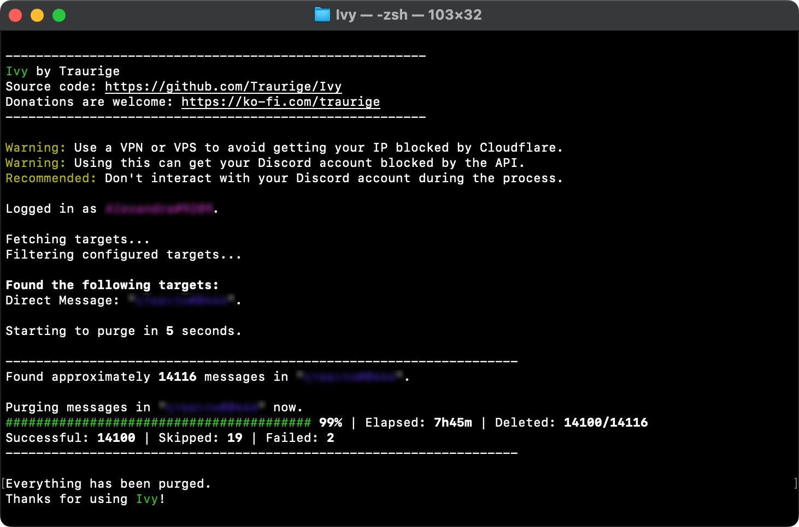

# Ivy
Bulk delete your Discord messages from the cli manually or automated

## Preview


## Installation
1. Install `NodeJS 18` and `npm 8`
2. `git clone https://github.com/Traurige/Ivy.git`
3. `cd Ivy`
4. `npm install`

## Usage
1. Compile the TypeScript files after the first installation or after an update
    - `npx tsc`
2. Run Ivy
    - `node src/index.js`

## Configuration
- `token` your Discord token ([How do I get it?](#Obtaining-Your-Token))
- `purgeChannels` if true, DMs will be purged
- `purgeGuilds` if true, servers will be purged
- `channelsToExclude` DMs that should be preserved
- `guildsToExclude` servers that should be preserved
- `onlyIncludeTheseChannels` don't purge anything, but these DMs
- `onlyIncludeTheseGuilds` don't purge anything, but these servers
- `includeNsfw` if true, messages from NSFW channels will be purged
- `deletePins` if true, pinned messages will be purged
- `deleteMessagesWithAttachments` if true, messages with attachments will be purged
- `excludeMessagesBeforeDate` don't delete messages before a given date

*`onlyIncludeTheseChannels` and `onlyIncludeTheseGuilds` are not influenced by `purgeChannels`, `purgeGuilds`, `channelsToExclude` and `guildsToExclude`*

### Example Configuration
```JSON
{
    "token": "a9sduo1onojaoIJDOjao9pjsIDJIPAIsdippa0q2jma",
    "purgeChannels": false,
    "purgeGuilds": true,
    "channelsToExclude": [], 
    "guildsToExclude": ["01283759812912", "4891212386571"],
    "onlyIncludeTheseChannels": [],
    "onlyIncludeTheseGuilds": [],
    "includeNsfw": true,
    "deletePins": false,
    "deleteMessagesWithAttachments": true,
    "excludeMessagesBeforeDate": "2020-05-24"
}
```

### Obtaining Your Token
1. Open the developer tools in your Discord client or browser logged into Discord
2. Copy and paste the following code into the JavaScript console:
```JavaScript
alert((webpackChunkdiscord_app.push([[''],{},e=>{m=[];for(let c in e.c)m.push(e.c[c])}]),m).find(m=>m?.exports?.default?.getToken!==void 0).exports.default.getToken());
```

## Automating Ivy
1. Create a shell script that executes `node src/index.js` inside the `Ivy` folder
```shell
#!/usr/bin/bash

cd path/to/ivy
node src/index.js
```
2. Register a cron job, which executes the script

## License
[MIT](https://github.com/Traurige/Ivy/blob/main/LICENSE)
